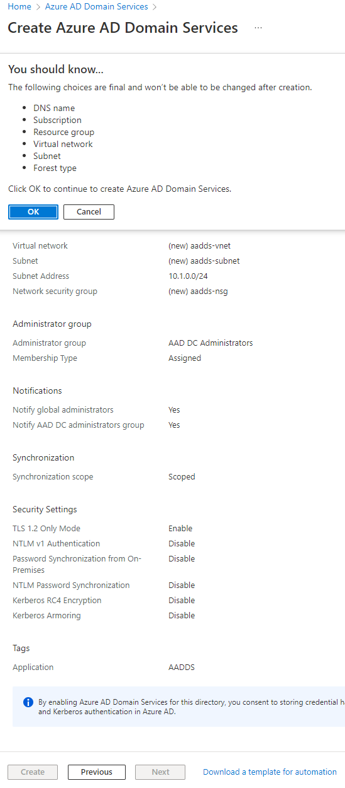

# Create an Azure Active Directory Domain Services

## Enter your information: Basics
- Select your Resource Group
- Enter the DNS domain name
- The region
- The SKU
- Forest type

## Enter your information: Networking
- Select your vnet or create a new one
- Select the subnet

## Enter your information: Administration
- Select accounts that will be member of the AAD DC Administrators

## Enter your information: Synchronisation
- Select if you want to sync all accounts or if you want to sync specific accounts

## Enter your information: Security Settings
- Here the default configuration
- Select which features you want to have

## Enter your information: Review + create
- Review all parameters
- Validate the creation

# Disclaimer
See [DISCLAIMER](./DISCLAIMER.md).