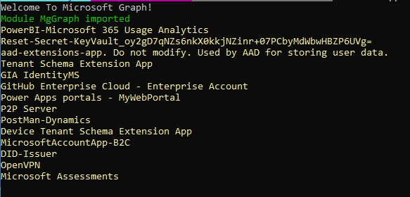
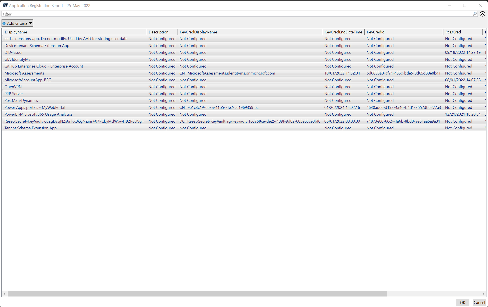
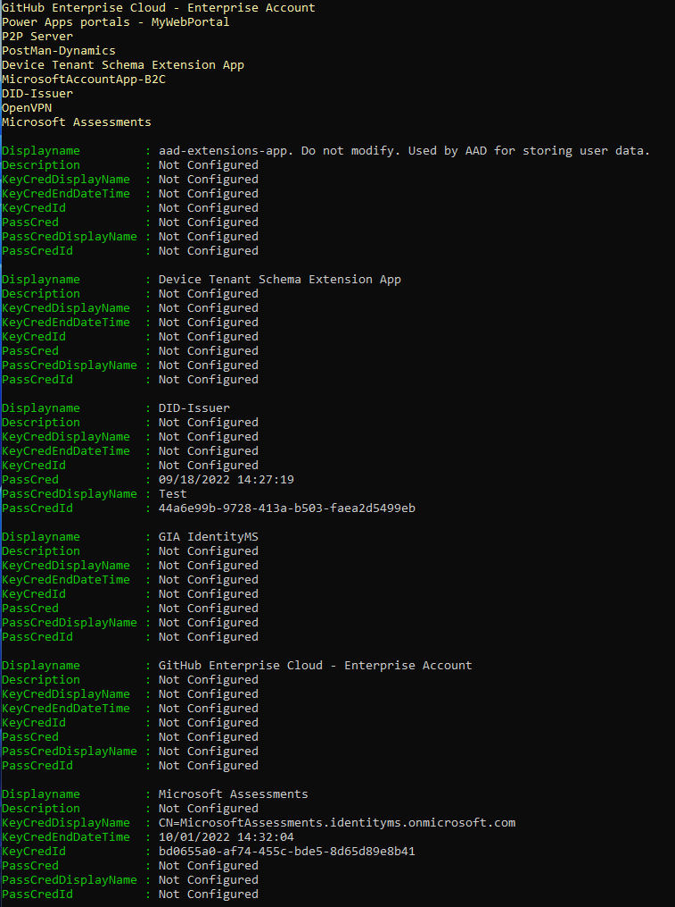
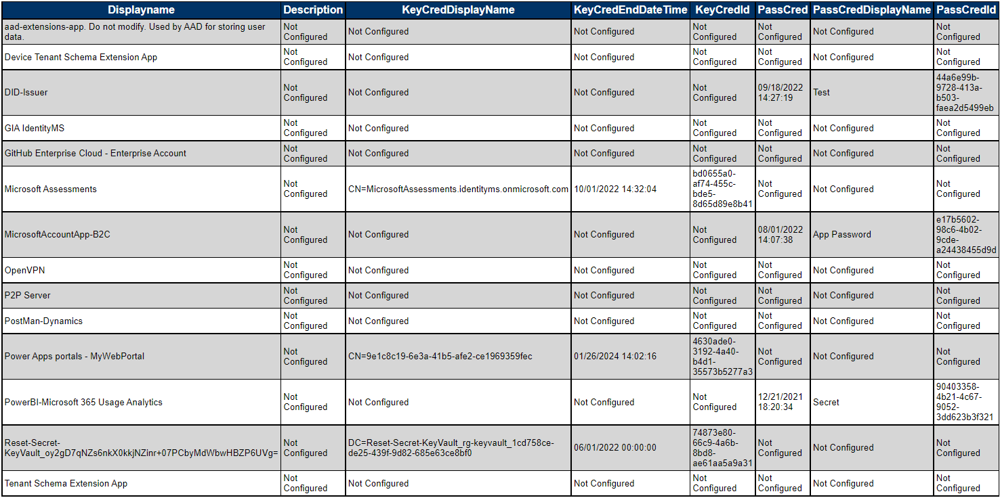

# List Applications
[]()

This script lists the application you have. It's possible to export them in CSV or HTML.

## Prerequisites
Modules: Microsoft.Graph.Applications, Microsoft.Graph.Authentication, Microsoft.Graph.Identity.SignIns

## Parameters
### Applications
List all applications

### ServicePrincipal
List all Service Principal

### ExportFile
Export your datas in CSV, HTML or both

## Using the script
```
PS> .\List-applications.ps1 -Applications
```




Select the columns you want to have


Select the data you want to have (ex: Ctrl + A)



Here the list of your apps with your selected columns.



Example of HTML report



## Using the script
```
PS> .\List-applications.ps1 -ServicePrincipal
```

## Using the script
```
PS> .\List-applications.ps1 -Applications -ExportFile "HTML"
```


# Disclaimer
See [DISCLAIMER](./DISCLAIMER.md).