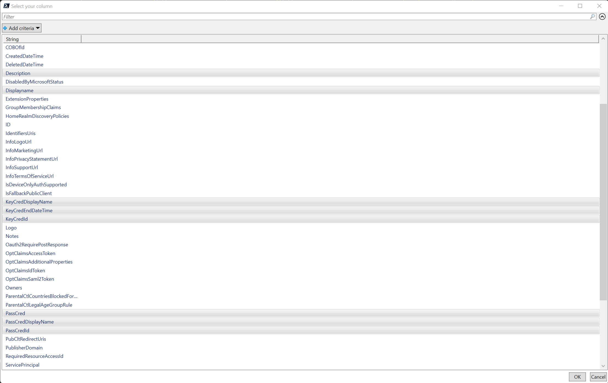

# List Applications
This script lists the application you have. It's possible to export them in CSV or HTML.

## Prerequisites
Modules: Microsoft.Graph.Applications, Microsoft.Graph.Authentication, Microsoft.Graph.Identity.SignIns

## Parameter Applications

## Parameter ServicePrincipal

## Parameter ExportFile

## Using the script
PS> .\List-applications.ps1 -Applications

Select the columns you want to have

Select the data you want to have (Ctrl + A)

Here the list of your apps with your selected columns.

## Using the script
PS> .\List-applications.ps1 -ServicePrincipal

## Using the script
PS> .\List-applications.ps1 -Applications -ExportFile "HTML"

## Using the script

# Disclaimer
See [DISCLAIMER](./DISCLAIMER.md).