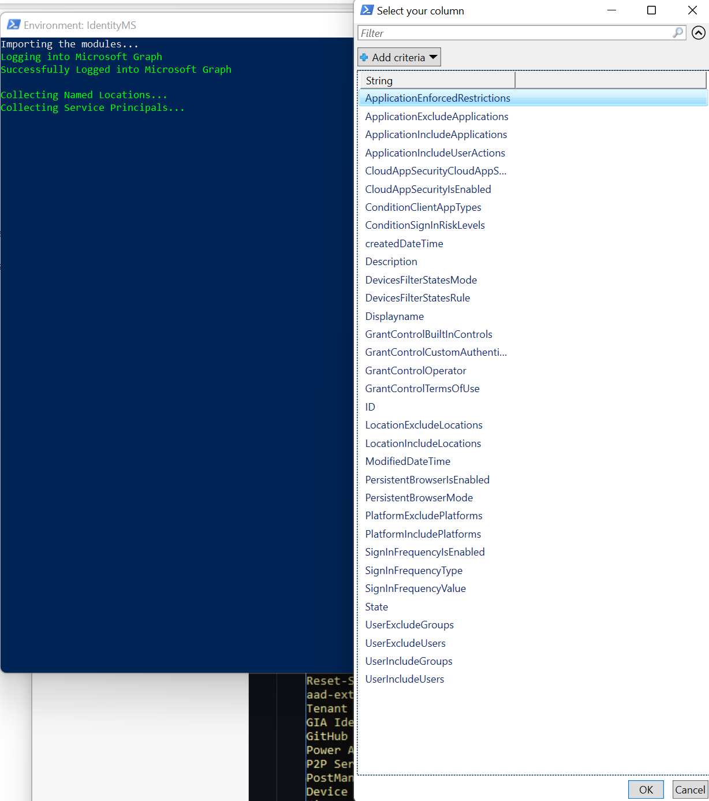
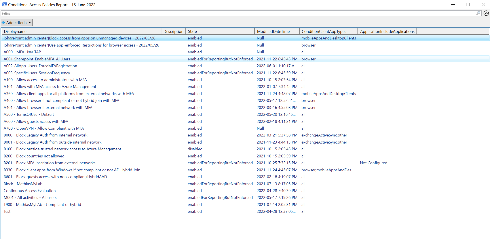
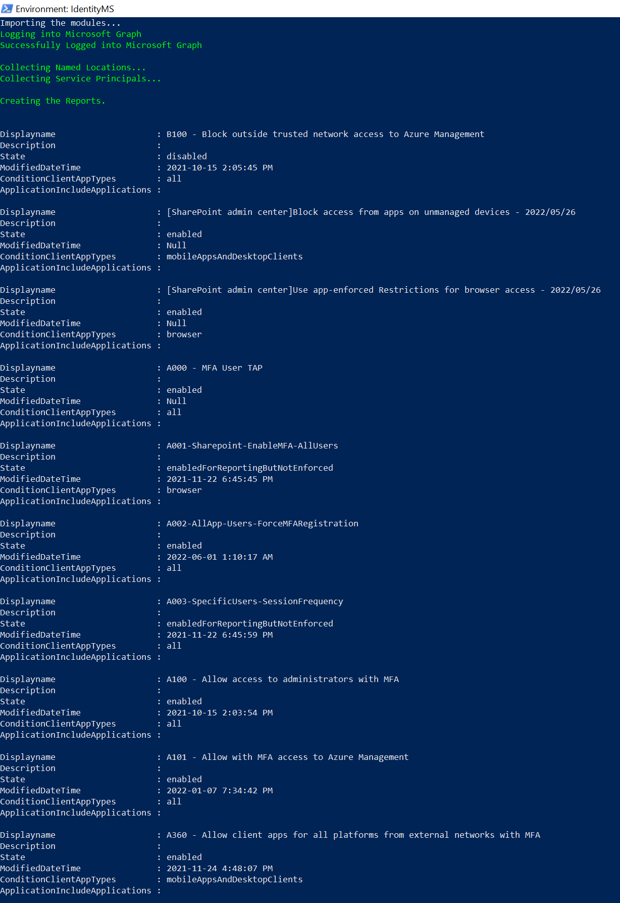

# Generate a ConditionalAccess report
This script generate a report of your rules and you can export them in CSV or HTML or both

## Parameters
### Export
Select type of export

## Using the script
Without export
```
PS> .\Generate-ConditionalAccess-Report.ps1
```
Select the columns you want to have


Select the data you want to have (ex: Ctrl + A)


Here the list of your apps with your selected columns.



With export
```
PS> .\Generate-ConditionalAccess-Report.ps1 -Export CSV
```


## Credits
Donovan Du Val / Mathias Dumont

# Disclaimer
See [DISCLAIMER](./DISCLAIMER.md).