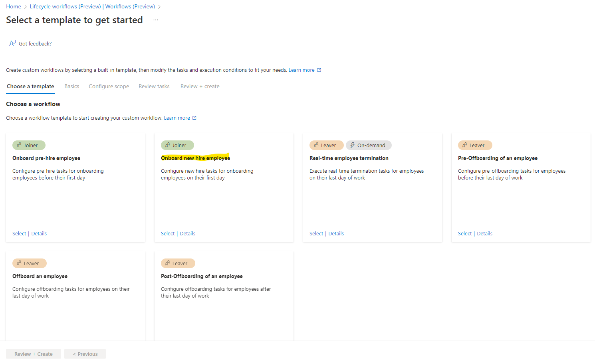
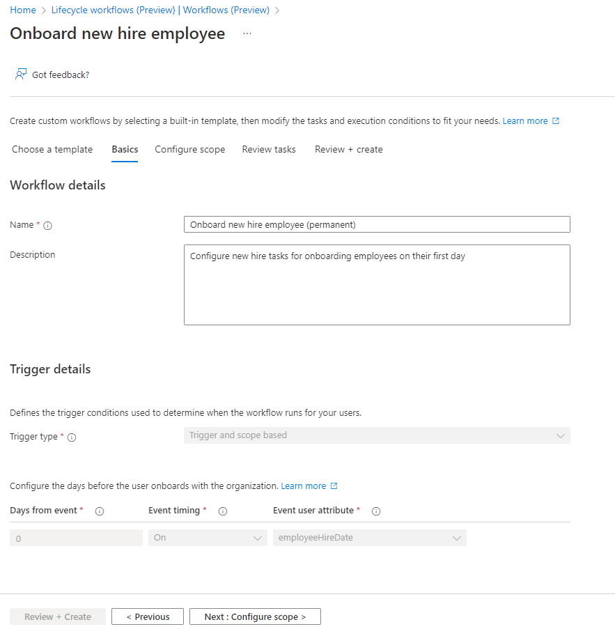
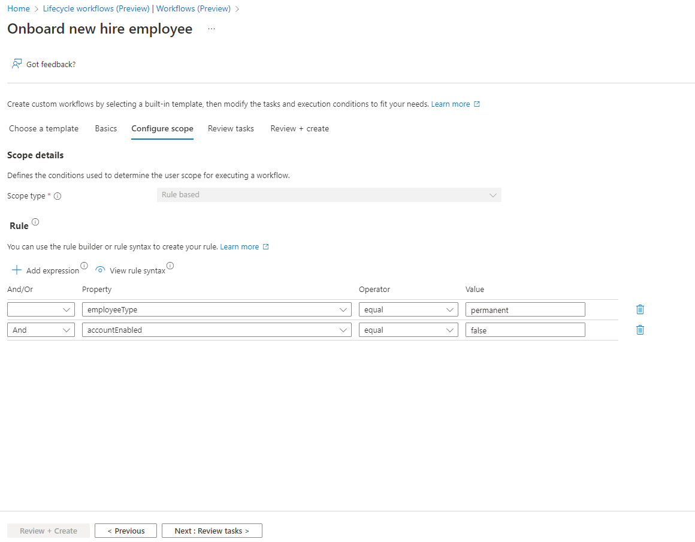
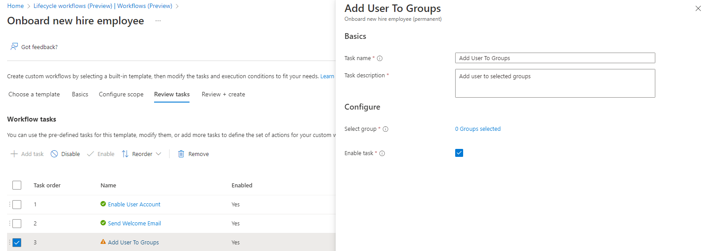
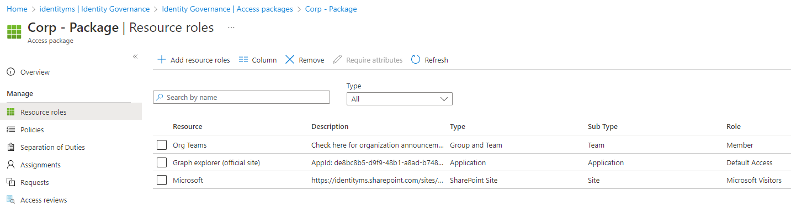
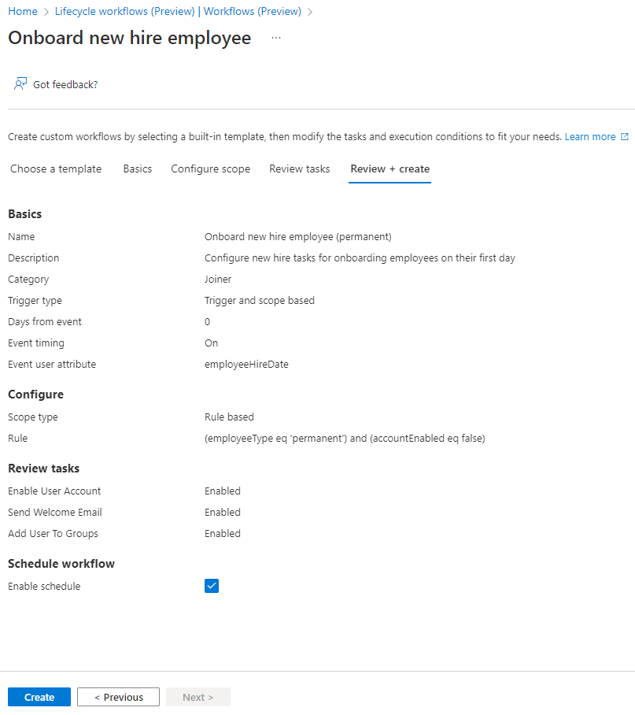
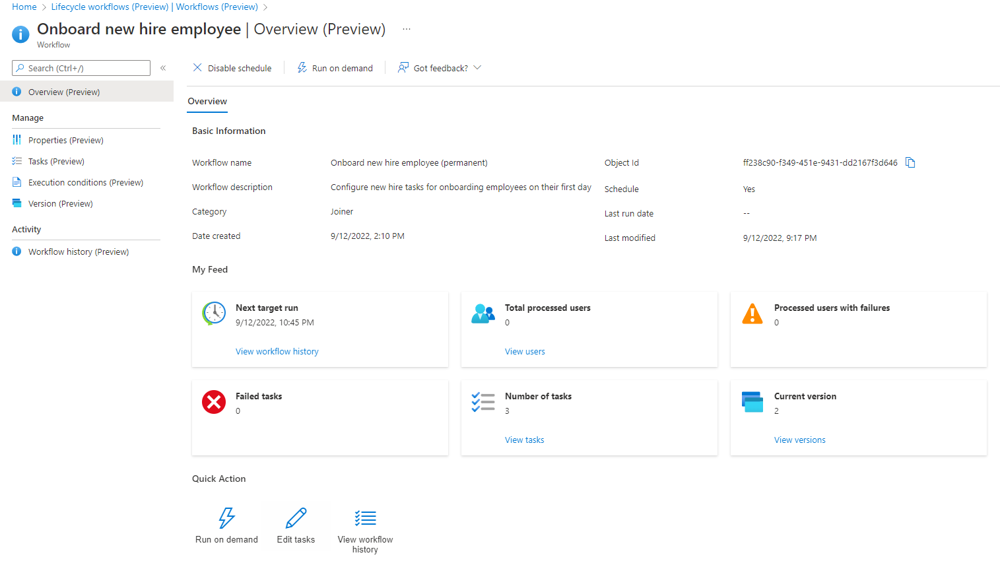

# New-hire
In this scenario, we want to execute tasks for newly hired employees (permanent). For example, we will enable the identity and assign it a default package.

## Create a new workflow
### Choose a workflow

### Basics info
- Define the name of this New-Hire employee workflow
- Enter a description which help all admins to understand the objective of this workflow

### Scope
- Select the attribute
- Select the operator
- Enter the value

We select the same criteria of the Pre-Hire workflow.

### Tasks
By default, these 3 tasks are added.

The task named "Add Users To Groups" requires your attention. Click on it and then on "0 Groups selected".

In my scenario, I selected a group named "AAD-SEC-Entity_Corp". This group is assigned to a package.

Here the list of available tasks.

### Review
Select "Enable schedule" to activate it.

## Modification
Select the workflow you want to modify and change the parameter you want.

### Overview
Here a dashboard of your workflow. You can disable it or run it.

