# Pre-hire
In this scenario, we want to execute some pre-hire tasks for employees (permanent).

## Create a new workflow
### Choose a workflow

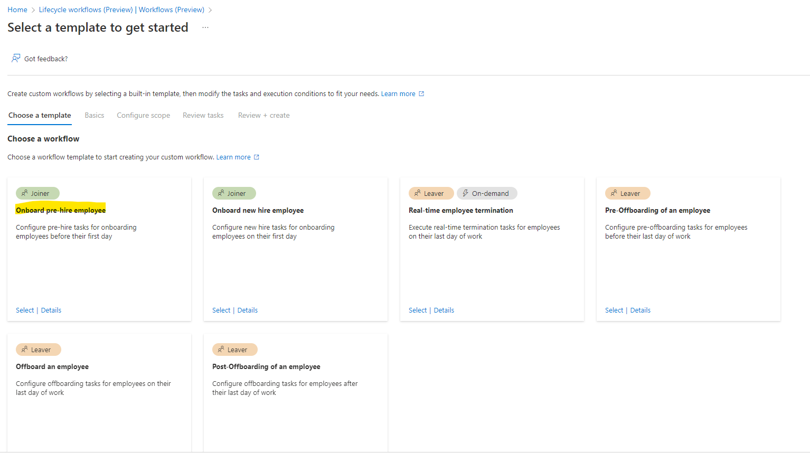

### Basics info
- Define the name of this Pre-Hire employee
- Enter a description which help all admins to understand the objective of this workflow
- Set the number of days before the hire date that this workflow should start. By default it's 7 days.

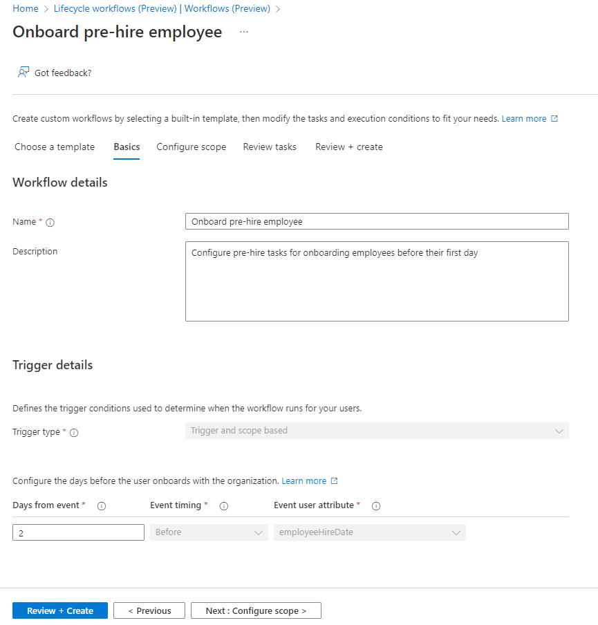

### Scope
- Select the attribute
- Select the operator
- Enter the value

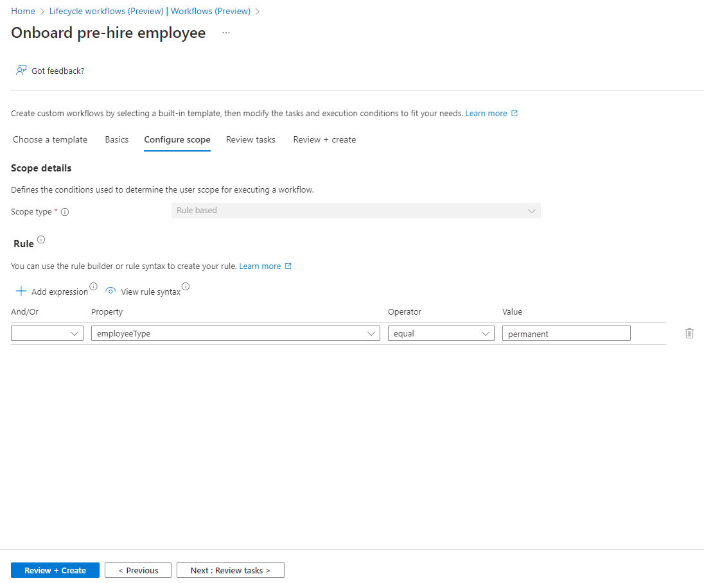

### Tasks
By default, this task is added. It will generate a TAP and will send it to the manager.

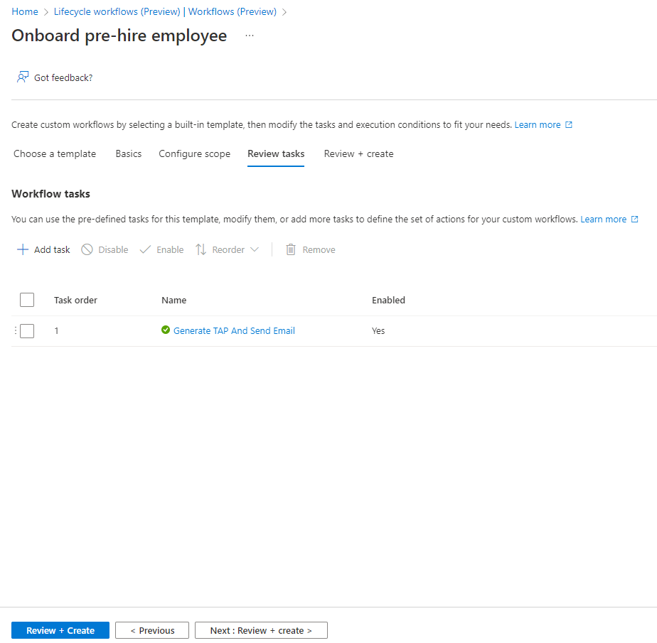

Here the list of available tasks.

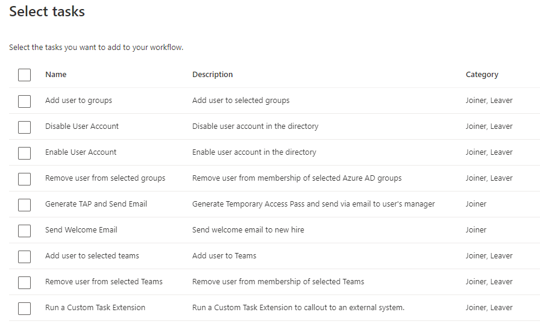

### Review
Select "Enable schedule" to activate it.

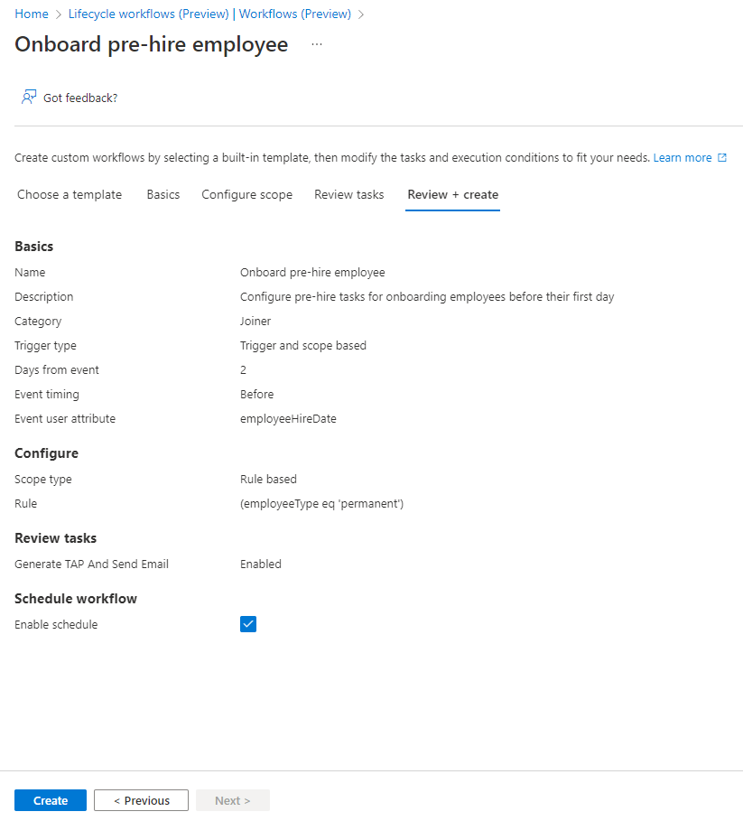

## Modification
Select the workflow you want to modify.

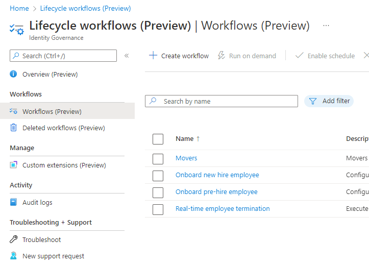

### Overview
Here a dashboard of your workflow. You can disable it or run it.

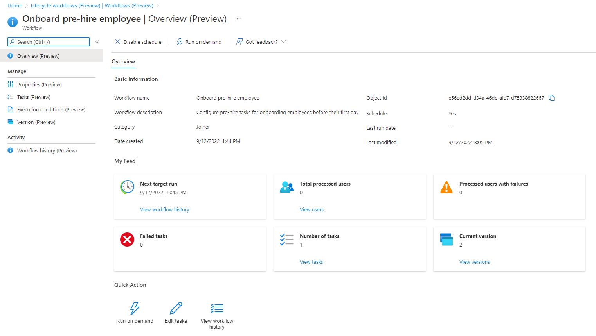

### Properties

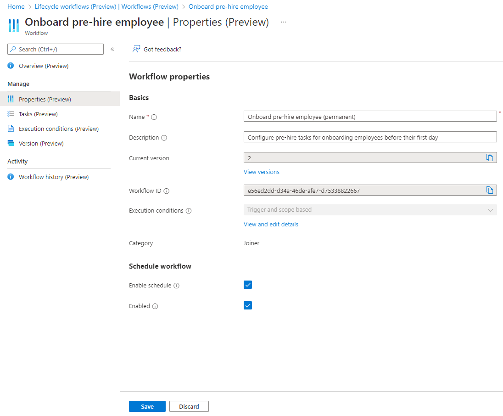

Click on "View and edit details" to modify the trigger and/or scope.

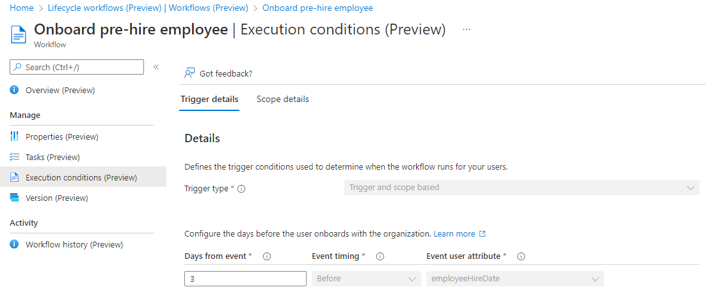

### Tasks
You can add/remove tasks.

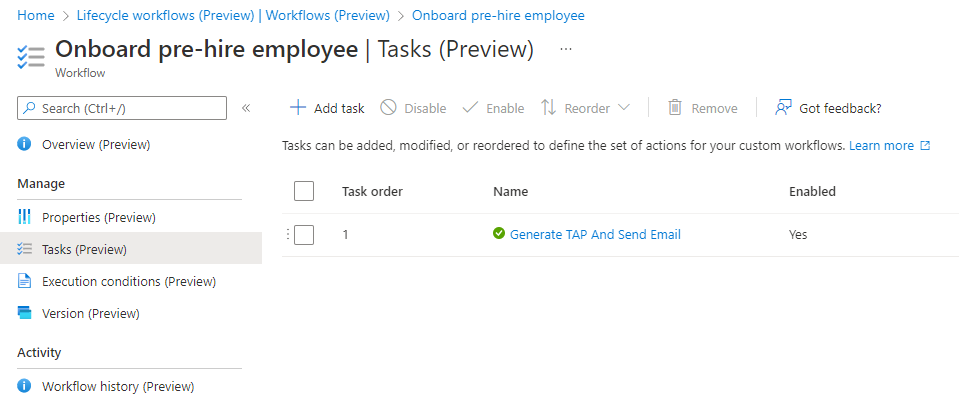

### Execution conditions
We added a new condition. This workflow will select only identity that are disabled. All new identities are disabled by default.

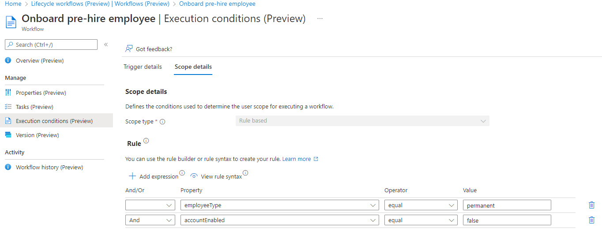

### Version
It's possible to review the old configuration.

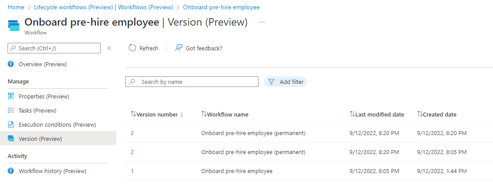

Click on the number.

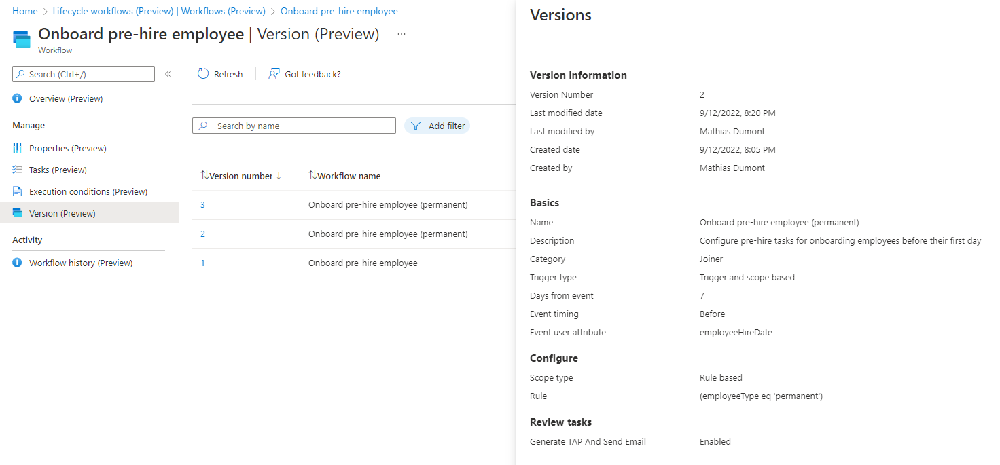

### Workflow history

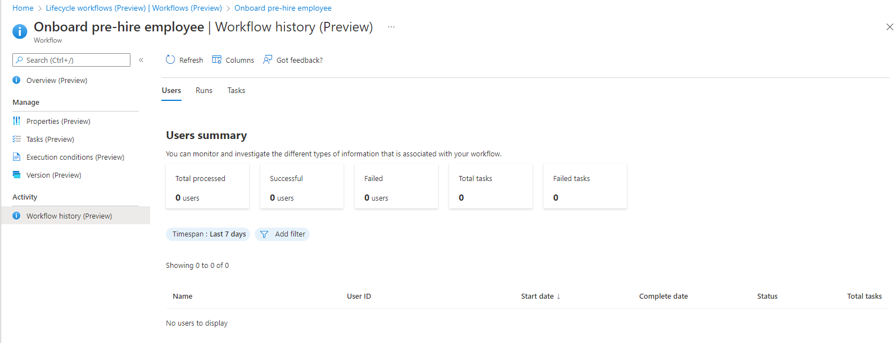

