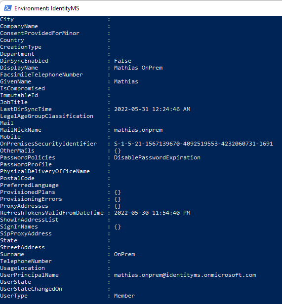

# On-Premises to Cloud
In this scenario, we want to migrate our hybrid identity to a cloud identity.

INFO: it's not possible to use MgGraph to do that.

## User objects
It's possible to convert identities to cloud-only.

### Identity info


### Unsync the user object
Move the user object in Active Directory to an unsynced OU. The user will be deleted in Azure AD.


### Restore the user in Azure AD
Restore the user in Azure AD


The user object will be restored


### Change the UserPrincipalName
It's necessary to change the value of immutableId
```
PS> Set-AzureADUser -ObjectId <objectId> -UserPrincipalName <upn@domain.onmicrosoft.com>
```


### Set ImmutableId to $null
Change the value of immutableId
```
PS> Get-AzureADuser -SearchString <UserPrincipaName> | Set-Msoluser -ImmutableId $null
```


### Everything is okay



# Disclaimer
See [DISCLAIMER](./DISCLAIMER.md).
