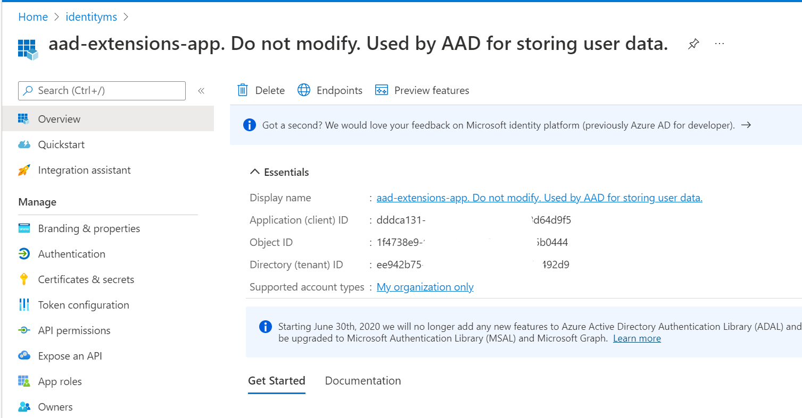
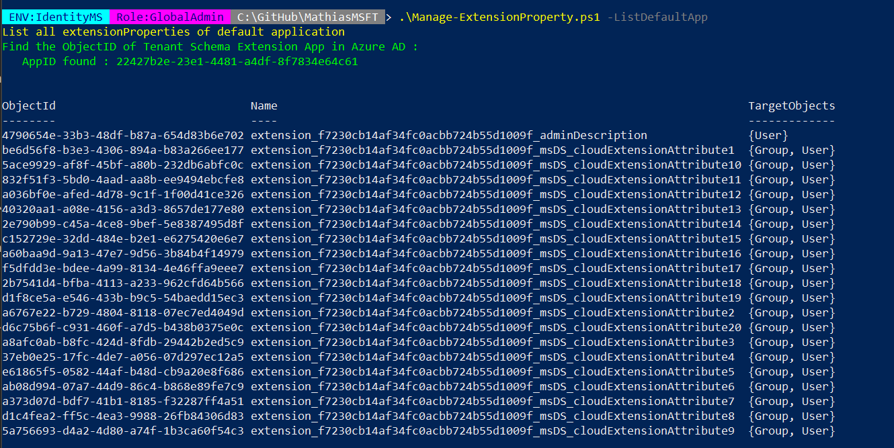

# Managing schema extension
[]()

In Active Directory you can use a lot of attributes to store information that you can use for specifc needs (identity management, access management, ...).
In Azure Active Directory you have less attributes and it works differently. You don't have only one "schema".
Let see.


## Directory Extension
Azure AD Connect uses a Directory Extension et External Identities also. 
When you enable "custom attributes", a new app is creating in your Azure AD named <b>Tenant Schema Extension App</b>.
For External Identities, the name is <b>aad-extensions-app. Do not modify. Used by AAD for storing user data</b>




If you want to get the list of attributes, it's not necessary to connect on Azure AD Connect. You can use this script: Manage-ExtensionProperty.ps1.


It's not recommended to use it to store user datas because that uses Azure AD Graph which will be deprecated.

## Open Extension


## Schema Extension


## Summary 

| Extension type        | Column1           | Stored        | Objects        | Format                               | SSO        |
| -------------------- :| -----------------:| -------------:| --------------:| ------------------------------------:| ----------:|
| Directory Extension   | right-aligned     | Application   | `user`,`group` | Extension_xxxxxxxxx_AttributeName    |            |
| Open Extension        | centered          | Application   |                |         |         |
| Schema Extension      |    $1             | Application   |                |         |         |

### Using the script
```
PS> .\List-applications.ps1 -Applications
```


Modules: Microsoft.Graph.Applications, Microsoft.Graph.Authentication, Microsoft.Graph.Identity.SignIns

## Parameters
### Applications
List all applications

### ServicePrincipal
List all Service Principal

### ExportFile
Export your datas in CSV, HTML or both


# Disclaimer
See [DISCLAIMER](./DISCLAIMER.md).